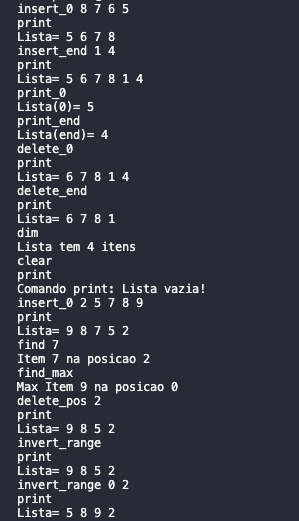

<h1 align="center">
    
</h1>

Pfolio Global de Programação por objetos - 21093 da UAb

📌 Programa EfolioA-EDAF-single-linked-list-
------------------
Programa em linguagem C++11 padrão que aceita comandos para a gestão de uma lista simplesmente ligada (single linked list) para armazenar itens que são números inteiros (positivos ou negativos). Neste caso os itens representam ambos os papéis de chave e de informação. Os comandos de um modo geral devem permitir inserir, remover, alterar, procurar itens na lista além de outros comandos mais específicos.
 
Para compilar colocamos na pasta principal o ficheiro CMakeLists e no terminal escrevemos: 
 
<strong>cmake -S . -B out</strong> 
<strong>cmake --build out</strong> 
 
<strong>OU</strong> 
 
<strong>cmake -S . -B out</strong>  
<strong>cd out </strong> 
<strong>make</strong> 

tambem na pasta src podemos compilar direto com o Gcc na linha de comandos escrevemos: 
<strong>g++ *.cpp -o efolioA -std=c++11</strong> 
 

🔧 Tecnologias utilizadas:
------------------

- <strong>C++</strong>
- <strong>Visual Studio Code</strong>
- <strong>QtCreator</strong>
- <strong>CMake</strong>
- <strong>Gcc</strong>
- <strong>MacOS</strong>

💬 Fale comigo
------------------
[*Entre em contato comigo*](https://www.linkedin.com/in/ivo-baptista-3712144/)

